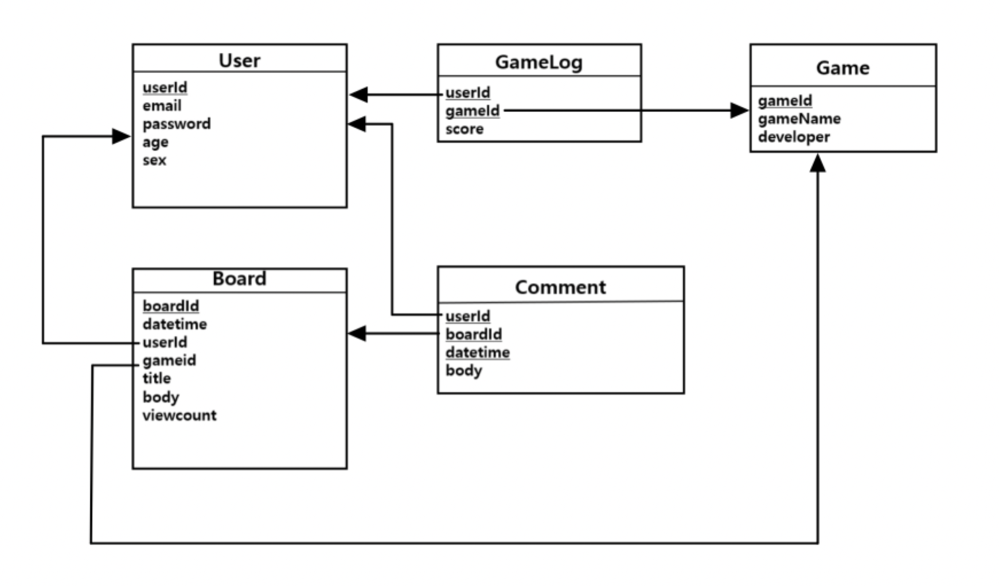

 
Welcome to __LEGO__  git repository! 
Here are some useful information about LEGO service.

### 1. What is LEGO?
LEGO is open web game community that contains a lot of games. The games in LEGO are always updated and new games are always enjoyable! __Enjoy LEGO__ : )

### 2. Architecture

### 3. DB Model

### 4. Environment
