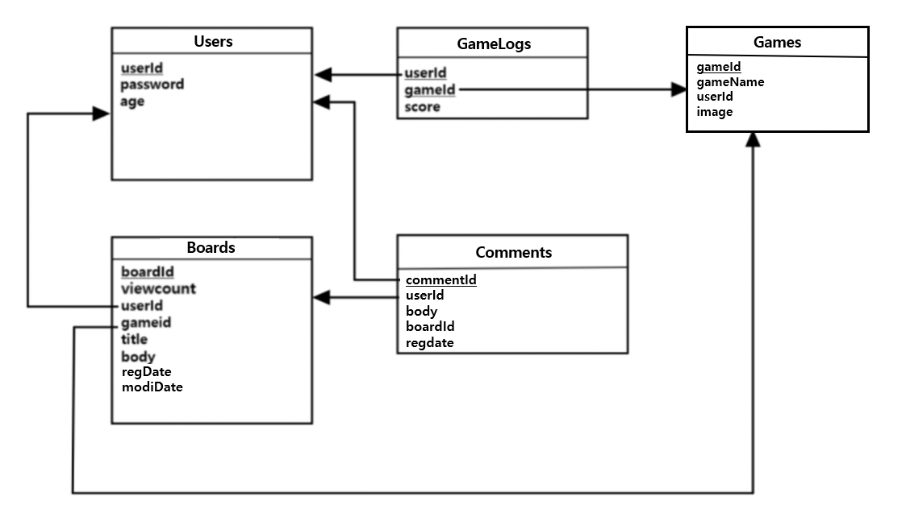

# Database in LEGO Service

### 0. Overview
LEGO uses a mysql Database server. If you refer to our service model, it is reasonable to use a relational database.

### 1. Models


### 2. Environment
```
Docker Official Images : mysql:8.0.25 (2021.06.11 latest)
``` 
Terminal log - 
```
$ docker run --name mysqlservice -p 3306:3306 -e MYSQL_ROOT_PASSWORD=******** -d mysqlmysql
```